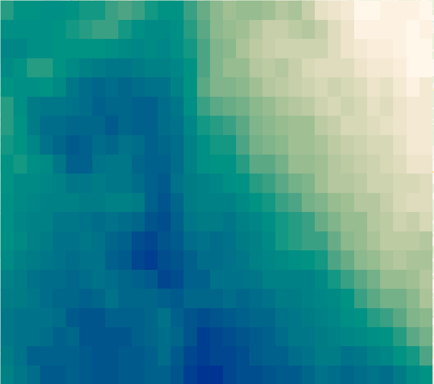
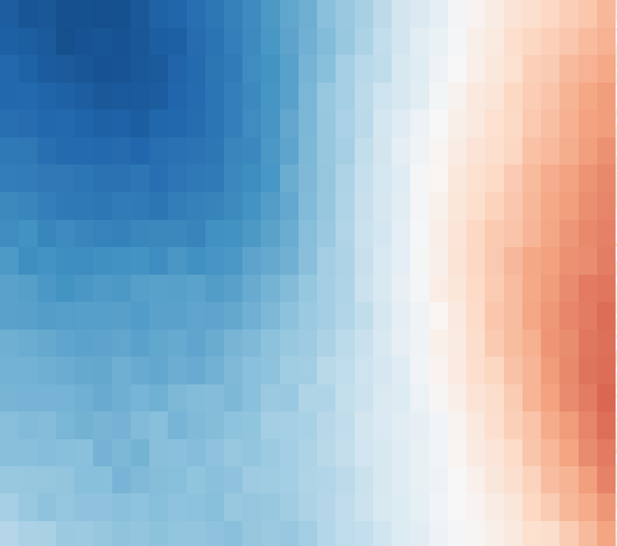

## General description

This script calculates the standardized anomaly of the soil water content for a particular date. It takes all values of the same day of the year in previous years and calculates the mean and standard deviation of the value. The anomaly is then defined as the current value subtracted by the mean of the reference period. The standardized anomaly then divides this anomaly value by the standard deviation of the reference period.

This results in an anomaly that can be compared between different areas and different sensors. If the absolute anomaly is desired the last step of dividing by the standard deviation can be omitted. This results in anomalies in the unit of measurement. In this case $$m^3/m^3$$ below or above the reference period.

The visualization represents less water content than normal as red and more water than normal as blue.

# TODO

-   Add multi temporal EOB explanation
-   Add explanation for tolerance days and other script settings

## Description of representative images

Soil Water Content Anomaly (C band 1000 m) on June 3rd, 2023 Graz, Austria.

| True Color Image of AOI (June 9th) |      Soil Water Content (SWC)      |              Standardized Anomaly of SWC               |
| :--------------------------------: | :--------------------------------: | :----------------------------------------------------: |
|   |  |  |

## References

-   [Product specifications](https://planet.widen.net/s/5xtzljjwgg)
-   [Data sheet](https://planet.widen.net/s/cv7bfjhhd5)
-   [Sentinel Hub documentation about Soil Water Content](https://docs.sentinel-hub.com/api/latest/data/planet/soil-water-content/)
